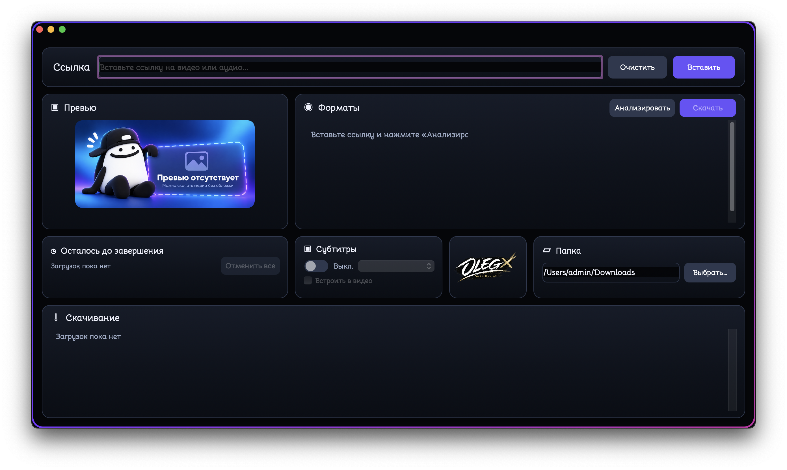

# Ozzy Media Downloader

[Русский](README.ru.md) · English

A macOS desktop app that lists available video and audio formats for a link and saves the selected format to a chosen folder. The downloaded application is named `Программа скачивания.app`. The interface uses Swift and AppKit. The app runs bundled `yt-dlp`, `ffmpeg`, and `deno` executables.

## Features

- Analyze an HTTP or HTTPS link for its title, thumbnail, MP4 and MP3 options, and subtitles.
- Choose MP4 quality or extract audio as MP3. Converting to MP3 does not improve the source audio quality.
- Request manual or automatic subtitles when available, with an option to embed them in video.
- Queue up to 10 simultaneous downloads, view progress, and cancel jobs.
- Keep the app available in the menu bar after closing its window, until choosing “Закрыть программу” (Quit).

Formats, subtitles, and downloads depend on the source. A site may reject a download even after formats appear during analysis. Download only material you have the right to use.

## Requirements and verification status

The single `.app` contains `x86_64` and `arm64` code. Its main executable targets **macOS 13.0 or later**. That minimum was checked in the binary; it does not prove successful operation on every macOS release. Build, launch, and the initial 1280 × 720 window size were checked on Intel. Testing of the updated build on Apple Silicon is still pending.

The bundle includes `deno` as the JavaScript runtime for YouTube support. The official `yt-dlp_macos` executable includes `yt-dlp-ejs`. YouTube support also depends on changes made by YouTube and on the connection.

## Installation and first launch

When a verified GitHub Release archive is available, extract it and move `Программа скачивания.app` to a convenient location, such as Applications. The app is signed ad hoc and is not notarized. macOS may require you to allow its first launch in **System Settings → Privacy & Security**. See [Apple's instructions](https://support.apple.com/guide/mac-help/open-a-mac-app-from-an-unknown-developer-mh40616/mac).

## Usage

1. Paste a link and click “Анализировать” (Analyze).
2. Choose a format and destination folder.
3. Optionally enable subtitles and select a language. If subtitle requests are limited by the source, try downloading without subtitles.
4. Click “Скачать” (Download). The job appears in the lower part of the window.

`HTTP 429: Too Many Requests` means the source limited requests. The error text can indicate whether it affected video or subtitles. See the [yt-dlp FAQ](https://github.com/yt-dlp/yt-dlp/wiki/FAQ#http-error-429-too-many-requests-or-402-payment-required).

## Source and build

App source is in `Sources/`; assets are in `Resources/`. See [BUILDING.md](BUILDING.md) for the build and required input files. See [THIRD_PARTY_NOTICES.md](THIRD_PARTY_NOTICES.md) for bundled tools and their licensing status.

**Binary release documentation:** [release-docs/README.md](release-docs/README.md) describes the bundled notices. [SOURCE_REFERENCES.md](release-docs/SOURCE_REFERENCES.md) lists tool downloads, version-specific source references and supplier build scripts.

## License

Copyright (c) 2026 OzzyLabz. The original application code and documentation use the custom [Noncommercial Use License 1.0](LICENSE). Use, modification and redistribution are permitted exclusively for noncommercial purposes. Selling the application or using the covered materials to earn income or obtain commercial benefit requires separate written permission. Third-party components retain their own licenses; see [THIRD_PARTY_NOTICES.md](THIRD_PARTY_NOTICES.md).
